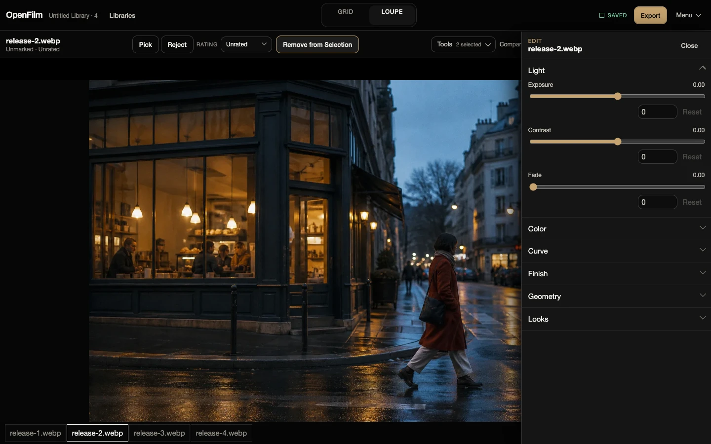

# OpenFilm

OpenFilm is a local-first browser workstation for reviewing, culling, comparing, and editing JPEG, PNG, and WebP photographs. It has no account system, application server, analytics, or upload path. Source photographs stay on your device.

[Try OpenFilm](https://openfilm.vercel.app/app.html) · [Product site](https://openfilm.vercel.app) · [CI](https://github.com/darshmahadevia/OpenFilm/actions/workflows/ci.yml)



## Why I built it

I built OpenFilm to see how much of a desktop photo workflow could live in the browser without taking custody of the photographs. That meant dealing with file-system permissions, crash-safe saves, GPU resource limits, and cross-browser fallbacks. Those became the most interesting parts of the codebase.

## What you can do

- Open a folder and review photographs while the grid fills progressively.
- Rate images or mark them as Pick, Reject, or Unmarked. Filter, sort, select ranges, and use optional auto-advance while culling.
- Inspect one image in Loupe or compare two to four images without losing the current selection.
- Adjust light, color, tone curves, grain, crop, rotation, and flips. Save adjustment sets as reusable Looks.
- Group bursts automatically from capture metadata or organize groups by hand.
- Export Picks or the current selection with collision-safe names. Folder export can resume from a manifest when the browser grants write access.
- Recover from interrupted saves, missing source files, expired folder permission, conflicting revisions, and invalid Library data without silently replacing the last good state.

OpenFilm Edits are non-destructive. A Library stores paths, metadata, ratings, Picks, groups, and Edit settings. It never stores Source image bytes.

## Browser support

Current desktop Chromium is the measured release target. Chrome and Edge can store the Library beside the selected photographs in an `.openfilm` folder and can write resumable exports to a folder.

Brave, Safari, and Firefox can use Browser Library mode when writable folder access is unavailable. In that mode, OpenFilm stores the Library document in IndexedDB, asks you to select the source folder again after a reload, and exports no more than 12 files through browser downloads.

All browsers need directory selection, IndexedDB, Web Workers, Web Crypto, Canvas, and WebGL2. See [the full browser and format limits](./docs/limitations.md) before relying on OpenFilm for a workflow.

## Run it locally

OpenFilm uses Node.js 22.20.0 and npm 11.19.0.

```sh
nvm install
npm ci
npm run dev
```

Vite serves the product site at `/` and the workstation at `/app.html`.

## Verify it

```sh
npm run check
npm run check:ui-slop
npm run test:e2e
npm run perf:generate
npm run test:e2e:performance
```

`npm run check` runs formatting, linting, type checks, unit tests, and a production build. The Playwright suite covers the import and export path, Library durability, accessibility, browser fallback behavior, and recovery states.

The performance test uses a deterministic 2,000-record Library and writes the browser result to `.artifacts/`. Its timings describe the test machine, not every device. The exact test boundary is documented in [`docs/testing.md`](./docs/testing.md) and [`docs/release-evidence.md`](./docs/release-evidence.md).

On the recorded Apple M4 baseline, that fixture reached a usable grid in 150.5 ms, kept 35 grid cells mounted, and performed no full-resolution reads while opening the Library.

## How it is built

OpenFilm is a static React 19, TypeScript 5.9, and Vite 8 application. The browser supplies folder authorization, IndexedDB persistence, worker threads, cryptographic checksums, and the WebGL2 rendering context. Loupe and final export share the same rendering code.

Folder Libraries use versioned JSON sidecars with checksums, parent revisions, pending and previous slots, and Web Locks. Browser Libraries persist the same versioned envelope in IndexedDB. Grid rows are virtualized, image work is scheduled with explicit concurrency limits, and derivative caches have byte budgets.

Read [`docs/architecture.md`](./docs/architecture.md) for module boundaries and [`docs/library-durability.md`](./docs/library-durability.md) for the save and recovery protocol.

## Known limits

OpenFilm does not support RAW, HEIC, HEIF, TIFF, camera profiles, soft proofing, cloud sync, cross-device Libraries, or archival metadata preservation. Export assumes sRGB and strips Source metadata. Comparison uses bounded 640-pixel derivatives and labels that limit in the interface.

The repository contains similarity and relative-sharpness analysis modules, but the product does not expose them. The project does not yet have a rights-cleared labeled corpus that meets its documented quality threshold.

## License

OpenFilm is available under the [MIT License](./LICENSE). Dependency licenses and asset provenance are recorded in [`THIRD_PARTY_NOTICES.md`](./THIRD_PARTY_NOTICES.md).
