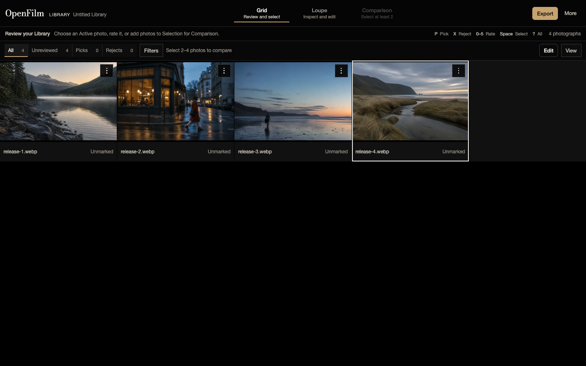

# OpenFilm

OpenFilm is a local-first desktop workstation for reviewing and editing a folder of JPEG, PNG, and
WebP photographs. It has no account system, application backend, or runtime upload path.

[Download for macOS](https://github.com/darshmahadevia/OpenFilm/releases/latest/download/OpenFilm.dmg) · [Download for Windows](https://github.com/darshmahadevia/OpenFilm/releases/latest/download/OpenFilm-Setup.exe) · [Visit the site](https://openfilm.vercel.app) · [Repository](https://github.com/darshmahadevia/OpenFilm) · [CI](https://github.com/darshmahadevia/OpenFilm/actions/workflows/ci.yml)



## Shipped workflow

- Create or reopen a Library beside a Source-photo folder. OpenFilm keeps its versioned sidecars in
  `.openfilm/`; Source bytes do not enter the Library document.
- Review a progressively populated, virtualized Grid with three densities, persistent active state,
  range Selection, filters, ordering, ratings, Pick/Reject/Unmarked, and optional auto-advance.
- Inspect one photograph in Loupe, compare two to four bounded derivatives, and edit Light, Color,
  Curve, Finish, Geometry, and Looks with the shared WebGL2 rendering path.
- Accept deterministic Burst proposals or make manual groups, then split, merge, dissolve, or dismiss
  them without losing provenance.
- Export Picks or the current Selection with collision-safe names and a resumable manifest when the
  browser grants folder write access. A bounded download fallback is available for up to 12 files.
- Recover explicitly from interrupted writes, stale revisions, missing Sources, permission loss,
  invalid Library files, and unsaved working state.

A Look is reusable rendering state. An Edit is one Photograph record's Look plus source-specific
geometry and revision. A Library is the durable local review record. See [CONTEXT.md](./CONTEXT.md)
for the project vocabulary.

## Run locally

OpenFilm uses Node.js `22.20.0` and npm `11.19.0`.

```bash
nvm install
npm ci
npm run electron:dev
```

`npm run dev` serves the download site at `/` and the browser workstation at `/app.html`.

## Package the desktop app

```bash
npm run electron:pack
npm run electron:dist:mac # run on macOS
npm run electron:dist:win # run on Windows
```

The first command creates an unpacked build for the current platform. The platform commands create a
universal macOS DMG and ZIP or an x64 Windows installer under `release/`.

Pushing a `v*` tag runs verification, builds each package on its native GitHub runner, and publishes
`OpenFilm.dmg`, `OpenFilm.zip`, and `OpenFilm-Setup.exe` in one GitHub Release. Stable asset names let
the landing page and desktop updater find the current platform package. Increment `package.json`
before every release so the updater can distinguish versions.

The current preview packages are unsigned. macOS Gatekeeper and Windows SmartScreen may require the
user to confirm that they want to open the app. Production distribution should add Apple signing and
notarization plus Windows code signing before removing the preview notice.

## Desktop updates

Installed builds from version 0.2.0 onward check GitHub Releases after startup and every four hours.
When an update is available, OpenFilm asks before downloading it and reports progress. It then opens
the DMG on macOS or launches the NSIS installer on Windows. Source photographs and Library state
remain in their existing folder.

The 0.1.0 app has no updater, so it needs one manual upgrade to 0.2.0 or later. The updater launches
the platform installer instead of modifying the installed app, so it also works for unsigned preview
packages. Gatekeeper or SmartScreen may still ask the user to confirm the installer.

## Verification

```bash
npm run check
npm run check:ui-slop
npm run test:e2e
npm run perf:generate
npm run test:e2e:performance
```

The performance gate uses a deterministic 2,000-record Library and records the measured browser
result under `.artifacts/`. Results are machine-specific; they are not a universal device claim.
See [testing](./docs/testing.md), [release evidence](./docs/release-evidence.md), and
[limitations](./docs/limitations.md).

## Architecture and privacy

OpenFilm is a React and Vite application packaged in a sandboxed Electron shell. Chromium directory
handles, IndexedDB working copies, Web Workers, and WebGL2 provide the local workspace; there is no
application server. Source files stay in the selected folder and are read only when needed for
metadata, visible derivatives, Loupe, or Export. Browser storage and sidecars are recovery
mechanisms, not backups. The installed app contacts GitHub Releases only for update checks and
installer downloads.

See [architecture notes](./docs/architecture.md) and the [Library workspace contract](./docs/library-workspace.md).

## Supported boundary

The desktop shell uses Electron's bundled Chromium runtime on macOS and Windows. RAW, HEIC/HEIF,
TIFF, archival color management, cloud sync, and cross-device Libraries are out of scope.
Comparison intentionally uses bounded derivatives and labels that limitation. Similarity and
sharpness analysis models exist behind tested module boundaries but are not exposed in the shipped
interface because a suitable
rights-cleared validation corpus has not passed the documented quality gate.

## License

OpenFilm is released under the [MIT License](./LICENSE). Dependency licenses and asset provenance are
recorded in [THIRD_PARTY_NOTICES.md](./THIRD_PARTY_NOTICES.md), beside generated assets, and in the
[release evidence](./docs/release-evidence.md).
