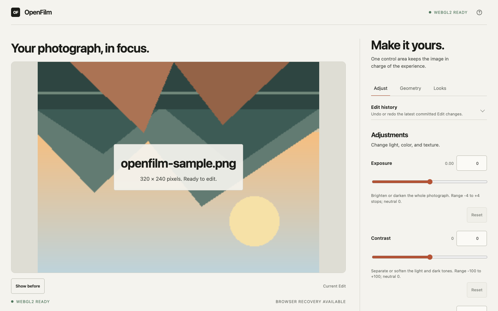
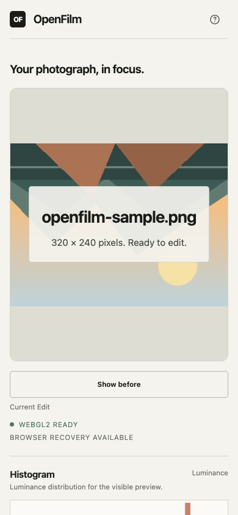

# OpenFilm

OpenFilm is a browser photo editor for applying reusable film-inspired Looks. The editor processes
photos locally. It has no account system, application backend, or photo upload.

[Try the live app](https://openfilm.vercel.app) · [View the repository](https://github.com/darshmahadevia/OpenFilm) · [Check CI](https://github.com/darshmahadevia/OpenFilm/actions/workflows/ci.yml)

The repository currently ships the single-photo editor shown here. The Library-based workstation
described in [issue #39](https://github.com/darshmahadevia/OpenFilm/issues/39) is the planned v2
baseline and is not implemented yet.

## Try it

The editor keeps the photograph in the foreground on desktop and phone-sized screens.





## What it does

- Import one JPEG, PNG, or WebP by picker or drag and drop.
- Adjust exposure, contrast, temperature, tint, saturation, fade, an RGB tone curve, vignette, and
  deterministic grain through WebGL2.
- Crop with free or common ratios, rotate in 90-degree steps, and flip horizontally or vertically.
- Use undo, redo, before and after, reset controls, and a luminance histogram.
- Apply bundled Looks, save custom Looks in IndexedDB, and exchange one versioned JSON preset file.
- Export a fresh JPEG, PNG, or WebP without changing the source photograph.

A Look is a reusable set of photographic adjustments. An Edit is one source photograph with its
current Look, geometry, history, and grain seed. Geometry belongs to the Edit, so it does not travel
with a reusable Look. See [the project glossary](./CONTEXT.md) for the full vocabulary.

## Run it locally

The project uses Node.js `22.20.0` and npm `11.19.0`. With [nvm](https://github.com/nvm-sh/nvm):

```bash
nvm install
npm ci
npm run dev
```

Vite prints the local URL. To preview a production build instead:

```bash
npm run build
npm run preview
```

If you do not use nvm, install the Node.js and npm versions above before running `npm ci`.

## Checks

`npm run check` runs formatting, linting, typechecking, unit tests, and the production build.

Run the browser suite separately. Install its Chromium browser once on a new machine:

```bash
npx playwright install chromium
npm run test:e2e
```

To run the same suite against production:

```bash
PLAYWRIGHT_BASE_URL=https://openfilm.vercel.app npm run test:e2e
```

See [testing and release checks](./docs/testing.md) for the full command list and manual checks.

## Privacy and storage

The browser reads and renders the source photograph locally. OpenFilm does not upload it. Export
creates a new local file and does not overwrite the source. IndexedDB may store custom Looks and the
latest recoverable Edit, including source bytes when the browser allows it. Browser storage is a
convenience for recovery, not a backup.

## Browser support and limits

The current editor needs WebGL2 for preview and export. The Playwright suite exercises Chromium at
desktop and phone-sized viewports. Other current browsers may work when they provide the required
APIs, but OpenFilm does not publish a compatibility matrix. The planned v2 workstation targets
current Chromium-family desktop browsers first and treats narrow CSS widths as desktop browser
layouts rather than a separate mobile workflow. It accepts JPEG, PNG, and WebP source photographs
and exports those same formats.

The import limit is 20 MiB. Decoded sources and exports are limited to 16,384 pixels per edge and
80,000,000 total pixels. The preview drawing buffer is limited to 4,096 pixels on its longest side.
Devices with limited GPU or canvas memory may support smaller images. See [browser limitations](./docs/limitations.md)
for recovery behavior, export details, and formats that are out of scope.

## Architecture

OpenFilm is a React and Vite app that builds to static files. The main code is grouped by behavior:

- `src/editor` owns Looks, Edits, geometry, adjustments, tone curves, presets, and edit history.
- `src/import` validates and decodes source photographs.
- `src/rendering` owns the WebGL2 preview, histogram, geometry, and export path.
- `src/storage` owns IndexedDB recovery and custom Looks.
- `src/ui` owns tokens, layout styles, and reusable controls.

See [architecture notes](./docs/architecture.md) for module responsibilities and test coverage.

## Deployment

The live app is a static Vercel deployment. `npm run build` creates the `dist/` directory used for
deployment. The project does not require server functions, a database, paid APIs, or analytics.

## Contributing

For a code change, run `npm run check`. If the change affects browser behavior, also run the
Playwright suite. Keep source photographs local and preserve the distinction between reusable Looks
and source-specific Edit state.

## License

OpenFilm is released under the [MIT License](./LICENSE). Dependency licenses and project links are
listed in [THIRD_PARTY_NOTICES.md](./THIRD_PARTY_NOTICES.md).
